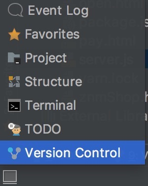
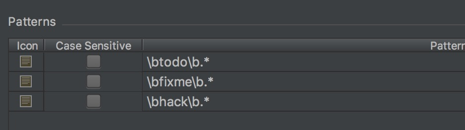

# 代码特殊注释 TODO FIXME HACK

TODO： 代办事项。该标识表示功能待编写，简略说明功能。

FIXME：已知的 BUG，带修复，简要说明 Bug 内容。

HACK：功能已实现，但方式不优雅，可以优化，简要说明优化方向。

## 在 WebStorm 中使用

移动到左下角的图标上，出现菜单栏，点击 TODO 项，会出现 TODO 界面

界面会展示当前项目中有 TODO FIXME HACK 注释的地方，双击即可跳转到对应的文件。

WebStorm 默认只识别 TODO 和 FIXME 注释，要支持 HACK 注释要进入 Preferences > Editor > TODO

添加 \bhack\b.* 支持 HACK 注释，还可以自定义样式和图标。