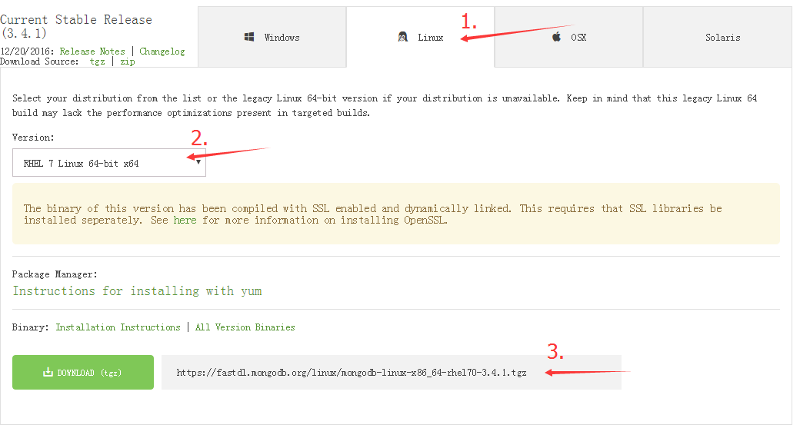

# CentOS 7 安装MongoDB 3.4.1

首先去官网寻找最新的版本的[MongoDB](https://www.mongodb.com/download-center#community)



选择Linux系统，Version选择RHEL 7 Linux 64-bit x64，找到下载地址，通过wget下载安装包

```shell
wget https://fastdl.mongodb.org/linux/mongodb-linux-x86_64-rhel70-3.2.6.tgz		# 等待下载完成
tar zvxf https://fastdl.mongodb.org/linux/mongodb-linux-x86_64-rhel70-3.2.6.tgz # 解压文件
mv mongodb-linux-x86_64-rhel70-3.4.1 mongodb # 通过mv命令重命名文件夹
cd mongodb	# 进入mongodb
mkdir db # 创建db文件夹
mkdir logs # 创建logs文件夹
cd bin	# 进入bin
vim mongodb.conf	# 创建mongodb.conf文件
```

mongodb.conf

```properties
# dppath指定刚才创建的db文件夹,数据存放的目录
dbpath=/root/installPackages/mongodb/db
# logpath指定在刚才创建的logs文件夹,指定一个文件名
logpath=/root/installPackages/mongodb/logs/mongodb.log
# mongodb端口
port=27017
# 设置是否后台运行,设置为true启动进程在后台运行的守护进程模式.默认为false.
fork=true
```

启动mongodb

```shell
# 启动mongodb
/root/installPackages/mongodb/bin/mongod -f /root/installPackages/mongodb/bin/mongodb.conf
# 启动成功后进入mongo shell模式
./mongo
# 查看数据库列表
show dbs
# 当前db版本
db.version()

```

***

#### 参考

[centos7 安装MongoDB](http://www.cnblogs.com/weiweictgu/p/5517717.html)

[mongodb.conf配置文件详解](https://my.oschina.net/pwd/blog/399374)


